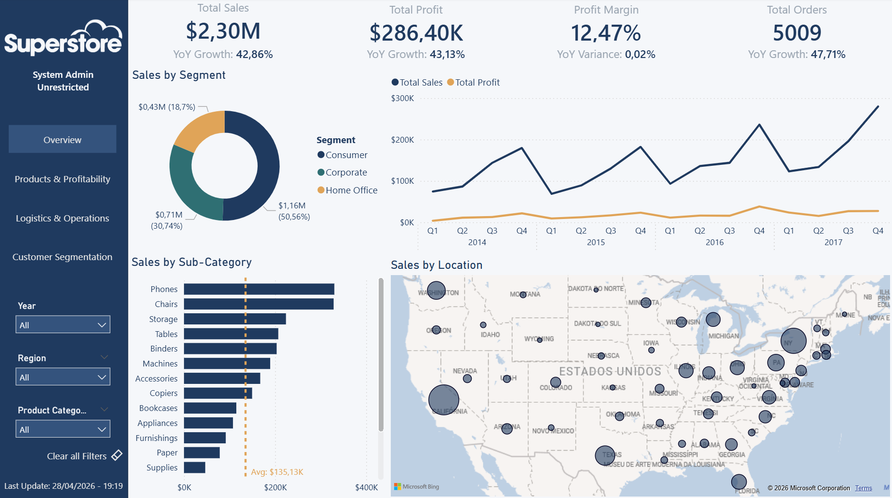
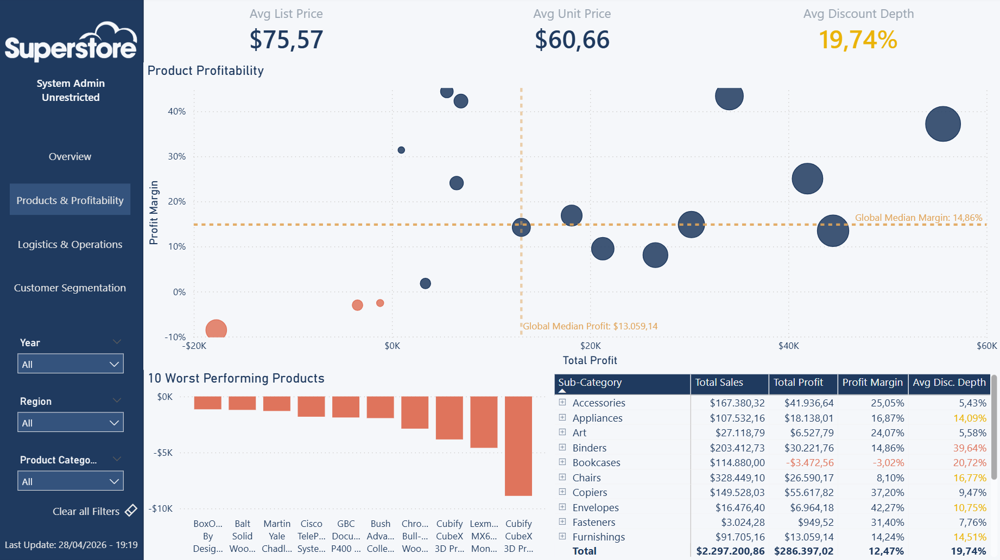
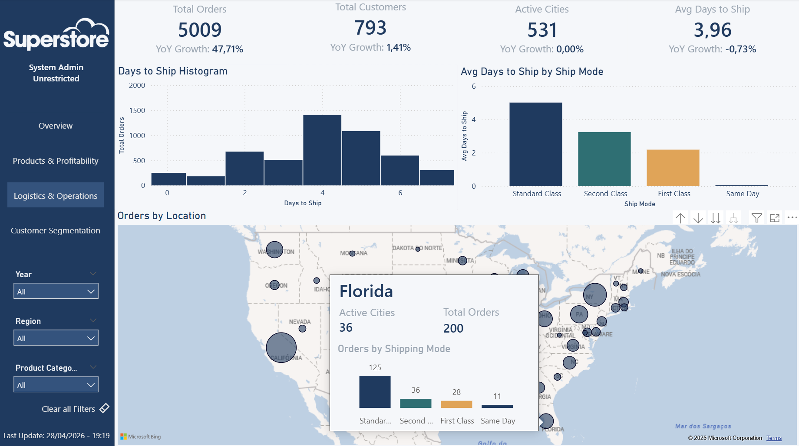
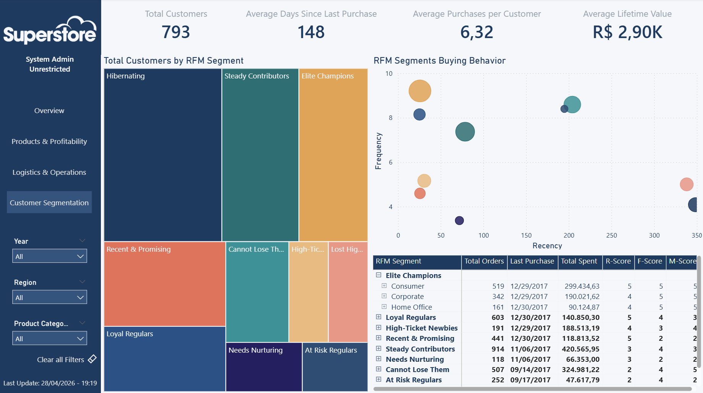
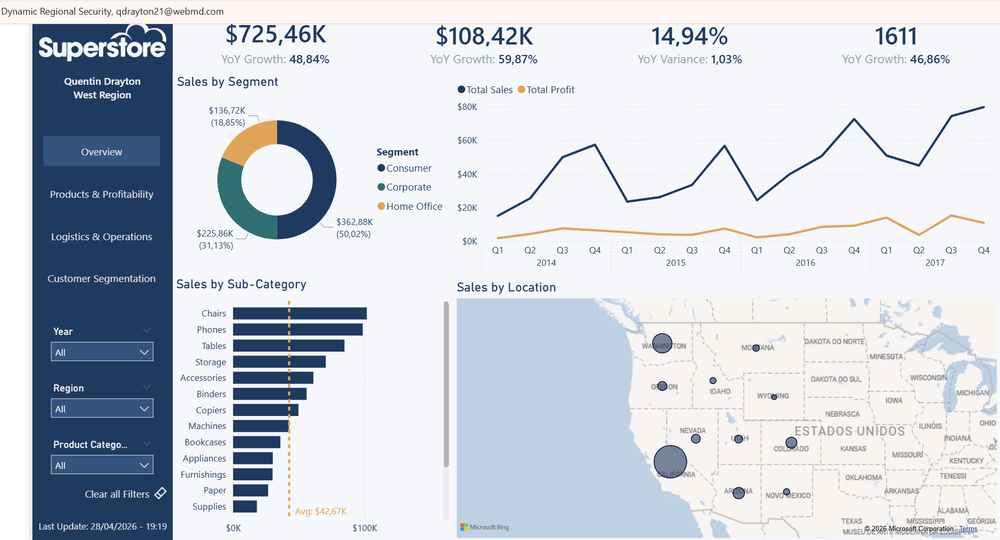
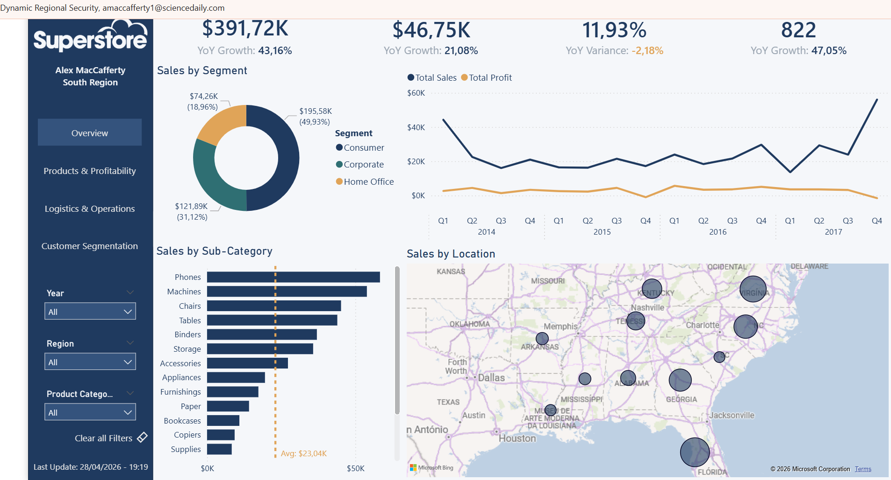
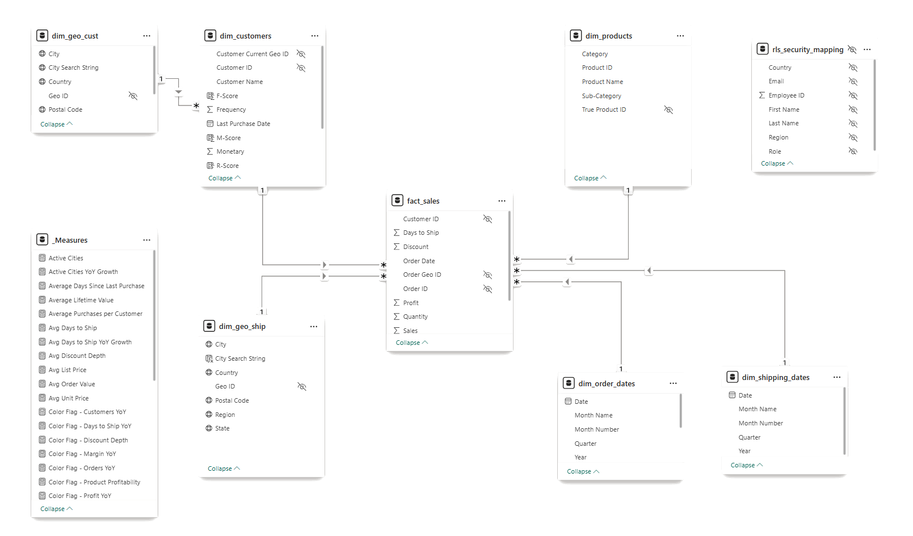

# Superstore Sales Intelligence — Power BI Portfolio Project


> A full-stack Power BI solution built on the classic Superstore dataset — star schema data model, 30+ DAX measures, dynamic RFM customer segmentation, and enterprise-grade Row Level Security, all across 4 analytical report pages.

---

## Live Report

<!-- After publishing: replace with your Publish to Web embed URL -->
> 🔗 **[View the live report →](#)** *(link to be added after Publish to Web)*

---

## Report Preview

| Overview | Product Profitability |
|----------|----------------------|
|  |  |

| Logistics & Operations | Customer Intelligence (RFM) |
|------------------------|----------------------------|
|  |  |

> **RLS in action:** Regional managers see only their territory.
> View examples:

| West Region | South Region |
|----------|----------------------|
 | 

---

## Business Context

A large retail chain needs to answer four operational questions:

1. **Is the business growing?** — Revenue and profit trends vs. the same period last year
2. **Which products are actually profitable?** — Breaking down profitability beyond blended margins
3. **How fast are orders reaching customers?** — Shipping performance by mode and geography
4. **Who are our best customers, and who's drifting away?** — Behavioral segmentation for retention

This report answers all four, with filters that travel consistently across every page.

---

## Data Model

A normalized star schema with 9 tables, built to be fast, maintainable, and RLS-ready.



**Key modeling decisions:**
- **References, not Duplicates** in Power Query — all dimension tables chain from a single `Source Table` so cleaning steps apply only once.
- **Role-playing geography dimensions** — `dim_geo_ship` (full history of order locations) and `dim_geo_cust` (last known customer address) are two copies of the same geography dimension. While `dim_geo_cust` provides customer context, `dim_geo_ship` serves as the main geographic dimension, allowing for geographic analysis. It serves also as a security dimension, filtering the fact table via RLS (Row-Level Security) to enforce territory-based access control.
- **Role-playing date dimensions** — `dim_order_dates` (active) and `dim_ship_dates` (inactive) allow time intelligence on both order date and ship date using `USERELATIONSHIP()` in DAX measures.
- **`Table.Buffer()` before dedup** — The product source data has a quality issue: some Product IDs map to multiple product names. To resolve this, products are sorted descending by order date so the most recent name wins, then duplicates are removed (~={red}a solução não foi esta. Acho que a ordenação foi por causa do endereço dos clientes=~). Power Query's lazy-evaluation engine can silently skip intermediate sorting steps during cloud refresh, producing non-deterministic dedup results. Wrapping the sorted table in `Table.Buffer()` forces the sort to fully evaluate before the dedup step runs.

---

## Report Pages

### Page 1 — Overview
Sales and profit performance at a glance: KPI cards with YoY growth references, revenue trend over time, sales by sub-category, segment breakdown, and a customer location map.


### Page 2 — Product Profitability
A 4-quadrant scatter plot (Total Profit × Profit Margin %) divided by median lines reveals four product archetypes: **All Stars** ⭐, **Volume Fillers**, **Cash Cows**, and **Profit Drains** 🚨. Drill levels: Category → Sub-Category → Product Name. Negative-profit sub-categories shown as an unfiltered bar chart (no arbitrary "Bottom 5" cutoff).


### Page 3 — Logistics & Operations
Shipping performance KPIs with YoY deltas, average days to ship by mode, and a geographic map with a dynamic tooltip that shows state or city name based on drill level, plus the top 5 sub-categories by sales for that location.


### Page 4 — Customer Intelligence (RFM)
Point-in-time customer segmentation across 10 tiers. No year slicer — this page is a snapshot, not a trend. A drillable treemap breaks segments down by customer type; a matrix surfaces individual customer metrics.


---

## Technical Highlights

### 10-Tier Custom RFM Segmentation

RFM (Recency · Frequency · Monetary) scoring built entirely in Power Query + DAX. Each dimension is scored 1–5 using PERCENTILE.INC — no hardcoded thresholds that break when the dataset changes.

A common 5-tier RFM model was set aside in favor of a custom 10-tier model that gives Monetary equal weight in segment naming — a Champion spending $50 is meaningfully different from one spending $5,000:

| Segment | Condition |
|---------|-----------|
| Elite Champion | R≥4, F≥4, M≥4 |
| Champion | R≥4, F≥4 |
| Loyal High Value | R≥3, F≥3, M≥3 |
| Loyal Customer | R≥3, F≥3 |
| Recent & Promising | R≥4, F≤2 |
| High Value At Risk | R≤2, F≥4, M≥4 |
| At Risk | R≤2, F≥4 |
| Dormant High Value | R≤2, F≤2, M≥3 |
| Hibernating | R≤2, F≤2 |
| Regular | (default) |

```dax
RFM Segment =
    VAR R = 'dim_customers'[R-Score]
    VAR F = 'dim_customers'[F-Score]
    VAR M = 'dim_customers'[M-Score]
    RETURN SWITCH(TRUE(),
        R >= 4 && F >= 4 && M >= 4, "Elite Champion",
        R >= 4 && F >= 4,           "Champion",
        R >= 3 && F >= 3 && M >= 3, "Loyal High Value",
        ...
    )
```


### Dynamic Row Level Security (RLS)

Regional managers see only their territory. Executives see everything. Implemented using `USERPRINCIPALNAME()` + a disconnected security mapping table (`rls_security_mapping`) queried at runtime via `LOOKUPVALUE()` — the same pattern used in production Power BI deployments.

```dax
-- Applied to dim_geo_cust table:
VAR CurrentUserRegion = LOOKUPVALUE(
    'rls_security_mapping'[Region],
    'rls_security_mapping'[Email], USERPRINCIPALNAME()
)
RETURN
    CurrentUserRegion = "All" || 'dim_geo_cust'[Region] = CurrentUserRegion
```

> **RLS in action:** Side-by-side screenshots showing West Manager vs. East Manager views. [View RLS screenshots →](screenshots/)


### DAX Measures Library (30+)

All measures live in a single `_Key Measures` table, organized into display folders:

| Folder | Sample measures |
|--------|-----------------|
| `1. Core Totals` | Total Sales, Total Profit, Total Orders, Total Customers, Total Quantity, Active Cities |
| `2. Averages & Ratios` | Average Order Value, Avg Unit Price, Avg List Price, Avg Days to Ship |
| `3. Profitability` | Profit Margin %, Profit per Unit, Discount Depth |
| `4. Time Intelligence` | Sales/Profit/Orders YoY Growth %, Margin YoY Variance, Avg Days to Ship YoY, Active Cities YoY |
| `5. Logistics` | *(verify contents)* |
| `6. Color Flags` | Product Status Color, Sales/Profit/Orders YoY Color, Margin YoY Color |
| `7. UI & System` | Active User Profile, Data Vintage |

**Profitability**
```dax
Profit Margin % = DIVIDE(SUM('Fact_Sales'[Profit]), SUM('Fact_Sales'[Sales]), 0)
-- SUM before DIVIDE to avoid the row-level averaging trap

Discount Depth = 1 - DIVIDE([Avg Unit Price], [Avg List Price])
-- Measures realized price erosion from list price (≠ raw Discount column)
```

**Time Intelligence**
```dax
Sales YoY Growth % = DIVIDE(
    [Total Sales] - CALCULATE([Total Sales], SAMEPERIODLASTYEAR('dim_order_dates'[Date])),
    CALCULATE([Total Sales], SAMEPERIODLASTYEAR('dim_order_dates'[Date])),
    BLANK()
)
-- BLANK() as fallback — cleaner than showing 0% or −100% for periods with no prior-year data
-- Note: Margin uses "Variance" not "Growth %" — margins don't compound like revenue
Margin YoY Variance = [Profit Margin %] - CALCULATE([Profit Margin %], SAMEPERIODLASTYEAR('dim_order_dates'[Date]))
```

**Color Flags** — KPI cards use DAX-driven conditional formatting with explicit thresholds (±10% for sales, orders, and profit; ±5pp for margin). One glance at any card reveals report health:

```dax
Sales YoY Color =
    IF([Sales YoY Growth %] > 0.10,  "#1F3A5F",   -- Strong growth: deep blue
    IF([Sales YoY Growth %] >= 0,     "#3E9297",   -- Modest growth: teal
    IF([Sales YoY Growth %] >= -0.10, "#E0A458",   -- Mild decline: amber
    "#DF745C")))                                    -- Significant decline: coral
```


### Power Query Architecture

- **Dynamic date dimension** spanning `MIN(Order Date, Ship Date)` through `MAX(Order Date, Ship Date)` — no hardcoded year boundaries
- **`dim_customers` built via Table.Group** — Frequency counts distinct Order IDs (not rows), Recency anchored to `List.Max(Order Date) + 1 day`
- **Surrogate key for products** — Superstore's Product ID maps to multiple names; a compound `(Product ID + Product Name)` key resolves the data quality issue


### Enterprise Navigation Panel

The dark blue left panel serves as both the report's control center and a live proof of concept for several advanced features. Every page shares the same panel, giving the report a web-application feel rather than a standard spreadsheet export.

**Panel layout (top to bottom):**

| Position | Element |
|----------|---------|
| Top | Company logo (embedded SVG — infinite scaling, zero file bloat) |
| Below logo | Dynamic RLS identity card |
| Middle | Custom page navigator |
| Lower middle | Slicers (Region, Year, Segment, etc.) |
| Below slicers | Clear Filters reset button |
| Bottom | Data vintage anchor |

**How it was built — key decisions:**

**Default tabs hidden.** Except for Overview, all report pages are hidden from the standard Power BI tab bar. The only navigation path is the custom Page Navigator visual in the panel, formatted with hover and selected-state effects. From the user's perspective, the report behaves like a coded web app.

**Dynamic RLS identity card.** A transparent Card visual displays the logged-in user's name and assigned territory, proving that Row Level Security is active without any backend explanation. Built with `CONCATENATEX` instead of `LOOKUPVALUE` so it handles managers assigned to multiple regions without throwing a multiple-values error:

```dax
Active User Profile =
VAR CurrentEmail = USERPRINCIPALNAME()
VAR CurrentName =
    CALCULATE(MAX('rls_security_mapping'[Name]),
              'rls_security_mapping'[email] = CurrentEmail)
VAR AssignedRegionList =
    CALCULATETABLE(VALUES('rls_security_mapping'[region]),
                   'rls_security_mapping'[email] = CurrentEmail)
VAR RegionString =
    CONCATENATEX(AssignedRegionList, 'rls_security_mapping'[region], ", ")
RETURN
SWITCH(TRUE(),
    ISBLANK(RegionString), "System Admin"  & UNICHAR(10) & "Unrestricted",
    RegionString = "All",  CurrentName & UNICHAR(10) & "Executive (Global)",
    CurrentName & UNICHAR(10) & RegionString & " Region(s)"
)
```

`UNICHAR(10)` forces a line break between name and region. The Card background is set to transparent so it sinks into the panel color.

**Clear Filters — data-only bookmark.** A reset button wired to a bookmark that has only the *Data* state checked (Display and Current Page are off). Unlike the native "Clear all slicers" action, this resets the full data state — including map click-selections and cross-filter highlights from charts — in a single click. New visuals added to the panel in the future are unaffected because the bookmark ignores the display layer entirely.

**Data vintage (Power Query timestamp).** A dedicated `Data Vintage Info` table is created in Power Query so the refresh timestamp is stamped at load time, not at query time:

```m
= #table({"Last Refresh"}, {{DateTimeZone.SwitchZone(DateTimeZone.UtcNow(), -3, 0)}})
```

The column type is cast to `Date/Time` (stripping the timezone metadata) before reaching DAX, so `FORMAT()` applies correctly. The measure reads the static table, meaning the timestamp only advances when the dataset actually refreshes — not when a user clicks a filter.

```dax
Data Vintage =
VAR RefreshTime = MAX('Data Vintage Info'[Last Refresh])
RETURN "Data Refreshed: " & FORMAT(RefreshTime, "MMM dd, yyyy")
```

---

## Tech Stack

| Tool | Usage |
|------|-------|
| **Power BI Desktop** | Report authoring, model, visuals |
| **DAX** | 30+ measures: aggregations, time intelligence, RFM scoring, color flags |
| **Power Query (M)** | ETL, star schema construction, RFM dimension |
| **Tabular model (VertiPaq)** | In-memory columnar storage, relationship engine |

---

## Dataset

The [Superstore Sales dataset](https://community.tableau.com/s/question/0D54T00000CWeX8SAL/sample-superstore-sales-excelxls) is a fictional US retail company used widely in data visualization education.

| Attribute | Value |
|-----------|-------|
| Rows | 9,994 orders |
| Geography | US — 4 regions, 49 states, 531 cities |
| Date range | 2014–2017 |
| Columns | Order ID, Dates, Customer, Product, Geography, Sales, Profit, Discount, Quantity, Ship Mode |

---

## Repository Structure

```
.
├── Superstore_Sales_Intelligence.pbix   # Power BI report file
├── data/
│   └── superstore.csv                   # Source dataset
├── screenshots/
│   ├── page-overview.png
│   ├── page-profitability.png
│   ├── page-logistics.png
│   ├── page-rfm.png
│   ├── data-model.png                   # Recommended: Power BI model view screenshot
│   └── rls-west-vs-east.png             # Side-by-side RLS demo
└── README.md
```
---

## How to Open

Click the [Live Report link](#) at the top of this page — no downloads or software required. Alternatively:

1. Install [Power BI Desktop](https://powerbi.microsoft.com/desktop/) (free)
2. Clone or download this repository
3. Open `Superstore_Sales_Intelligence.pbix`
4. The data is embedded — no connection setup needed

To test RLS locally: **Modeling tab → View as → select a role** and enter one of the mock emails from `rls_security_mapping`.

---

## Contact

**André Pintor** — [LinkedIn](https://linkedin.com/in/andre-pintor) · [GitHub](https://github.com/Yfy21)
